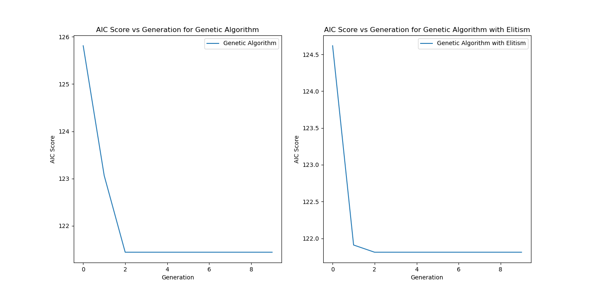

# Optimal Feature Selection for Body-Fat Dataset - A Genetic Algorithm Approach

## Introduction to Evolutionary Computational Methods

Evolutionary computational methods are inspired by the process of natural selection and biological evolution. These methods are used to solve optimization problems by iteratively improving a set of candidate solutions with respect to a given measure of quality. The most common evolutionary computational methods include Genetic Algorithms (GAs), Genetic Programming (GP), Evolutionary Strategies (ES), and Differential Evolution (DE).

## Genetic Algorithms

Genetic Algorithms (GAs) are a class of evolutionary algorithms that use techniques inspired by evolutionary biology such as inheritance, mutation, selection, and crossover (recombination). GAs are particularly useful for solving complex optimization problems where the search space is large and poorly understood.

### Variants of Genetic Algorithms

1. **Standard Genetic Algorithm $(\mu , \lambda)$**: Uses basic operations of selection, crossover, and mutation. In this approach, a population of candidate solutions is evolved over several generations. Each generation involves selecting the fittest individuals based on a fitness function, performing crossover to combine the genetic information of parent individuals, and applying mutation to introduce variability. The process is repeated until a stopping criterion is met, such as a maximum number of generations or a satisfactory fitness level.
2. **Elitist Genetic Algorithm $(\mu + \lambda)$**: This variant of the genetic algorithm ensures that the best individuals (those with the highest fitness scores) are carried over to the next generation without undergoing crossover or mutation. By preserving the top-performing individuals, the elitist genetic algorithm maintains high-quality solutions and prevents the loss of valuable genetic information. This approach often leads to faster convergence and more consistent improvements in the fitness score compared to the standard genetic algorithm.
3. **Steady-State Genetic Algorithm**: Only a few individuals are replaced in each generation.

## Objective of the Project

The objective of this project is to apply Genetic Algorithms to the problem of feature selection for predicting body fat percentage from a set of physical measurements. The goal is to identify the most relevant features that contribute to accurate predictions while minimizing the Akaike Information Criterion (AIC) score, which balances model complexity and goodness of fit. Additionally, this project compares the performance of the standard Genetic Algorithm (GA) with the elitist Genetic Algorithm (GA) to determine which approach yields better results in terms of AIC score reduction.

## Methodology

### Data Preparation

The dataset used in this project is the Body-Fat Prediction Dataset, which contains 252 entries and 15 columns, including the target variable `BodyFat` and 14 predictor variables such as `Density`, `Age`, `Weight`, `Height`, etc. The dataset was downloaded from Kaggle and loaded into a pandas DataFrame for analysis.

### Standardization

The dataset was standardized to ensure that all features contribute equally to the model. Standardization involves scaling the features so that they have a mean of zero and a standard deviation of one.

### Genetic Algorithm Implementation

#### Fitness Function

The fitness function used in this project is the Akaike Information Criterion (AIC)

The Akaike Information Criterion (AIC) is a measure used for model selection in statistics. It evaluates the quality of a model by balancing the goodness of fit and the complexity of the model. Specifically, AIC is calculated using the formula: 

$$AIC = 2k - 2ln(\hat{L})$$

where, $k$ = number of estimated parameters .
      $\hat{L}$ = maximised value of likelihood function.

In this project, AIC is implemented as the fitness function to assess different models. By comparing the AIC values of various models, the one with the lowest AIC is selected as the best model, as it indicates a good fit with fewer parameters, thereby avoiding over-fitting.

#### Genetic Algorithm Operations

1. **Parent Population Generation**: Randomly generate initial parent populations.
2. **Fitness Calculation**: Calculate the fitness of each parent using the AIC score.
3. **Selection**: Select the fittest parents for crossover.
4. **Crossover**: Perform uniform crossover to generate new offspring.
5. **Mutation**: Apply random bit-flip mutation to introduce variability.

### Genetic Algorithm Execution

Two variants of the genetic algorithm were implemented: the standard genetic algorithm and the elitist genetic algorithm. The standard genetic algorithm involves generating new populations through crossover and mutation, while the elitist genetic algorithm ensures that the best individuals are carried over to the next generation.

### Parameters Set for Execution

To ensure the genetic algorithms were executed effectively, several parameters were carefully set and tuned:

1. **Population Size**: The initial population size was set to 50 individuals.

2. **Number of Generations**: The algorithms were run for 10 generations.

3. **Selection**: The selection of parents was set to 10.

3. **Crossover Rate**: The crossover rate was set to 0.5, meaning that 80% of the selected parents underwent crossover to produce offspring. This rate was chosen to ensure a high level of genetic mixing while maintaining some stability in the population.

4. **Mutation Rate**: The mutation rate was set to 0.2

5. **Elitism**: For the elitist genetic algorithm, the elitism rate was set to 5.

These parameters were determined through a combination of literature review and empirical testing to ensure that the genetic algorithms performed optimally for the feature selection task.

## Results

The genetic algorithms were run, and the AIC scores were collected over multiple generations. The results indicate that both the standard genetic algorithm and the elitist genetic algorithm successfully reduced the AIC score over multiple generations.

Final AIC Score by $(\mu , \lambda)$ Genetic Algorithm: 121.44030760398728
Final AIC Score by $(\mu + \lambda)$ Genetic Algorithm: 121.81114377996589

### AIC Score Plots

The following plots show the AIC scores over generations for both the standard genetic algorithm and the elitist genetic algorithm:

## Discussion

The results indicate that both the standard genetic algorithm and the elitist genetic algorithm successfully reduced the AIC score over multiple generations. The elitist genetic algorithm showed a more consistent and rapid decrease in AIC score compared to the standard genetic algorithm, suggesting that carrying over the best individuals to the next generation helps in maintaining high-quality solutions.

## Conclusion

This project demonstrated the effectiveness of genetic algorithms in feature selection for predicting body fat percentage. The use of AIC as a fitness function ensured that the models were both accurate and parsimonious. The elitist genetic algorithm outperformed the standard genetic algorithm, highlighting the importance of preserving high-quality solutions across generations. Future work could explore other evolutionary strategies and hybrid approaches to further improve the results.

